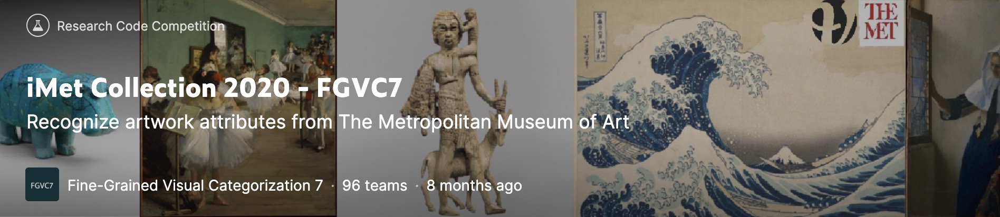

# iMet Collection 2020 - FGVC7

## task
- multi label image classification

## evaluation
- f2 score 
- this metric is chosen to provide some robustness against noisy labels, favoring recall over precision

## data
### overview
- The Met, has a diverse collection of over 1.5M objects of which over 200K have been digitized with imagery
- This competition use only 229k digitized images
- images are often centered for objects
- difference of imet2019 competition
  - +74K images
  - +some artwork attributes: medium, culture, country
  - +2371 labels

### annotation
 - single annotator, no verification step
 - annotation is noisy because single annotator annotate 3474 labels. it's so hard.

### detail
- train images: 142119
- public test images: 25958
- private test images: 55161
- number of labels: 3474
  - medium: 1920
  - tags: 768
  - culture: 681
  - country: 100
  - dimension: 5

## link
- competition: [https://www.kaggle.com/c/imet-2020-fgvc7/overview](https://www.kaggle.com/c/imet-2020-fgvc7/overview)
- solution presentation at CVPR2020: https://www.youtube.com/watch?v=7tVBBeyGiPo&ab_channel=FGVCWorkshop (30min~)